# Employee Management System

A comprehensive web application for managing employees, job listings, and complaints, with user profiles and authentication. This project is divided into two main parts: the frontend (React.js) and the backend (Node.js/Express.js).

## Table of Contents

- [Overview](#overview)

- [Screenshots](#screenshots)

- [Features](#features)

- [Tech Stack](#tech-stack)

- [Installation](#installation)

- [Usage](#usage)

- [API Endpoints](#api-endpoints)

- [Folder Structure](#folder-structure)

- [Contributing](#contributing)

- [License](#license)

## Overview

The Employee Management System allows managers to handle employee records, job postings, and complaints efficiently. Employees can view job listings, submit complaints, and view their profiles. The system includes user authentication, role-based access control, and various management tools.

## Screenshots

### Login Page

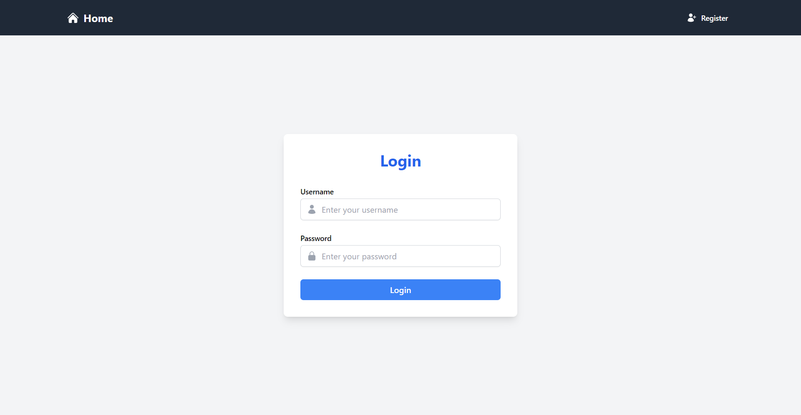

### Registration Page

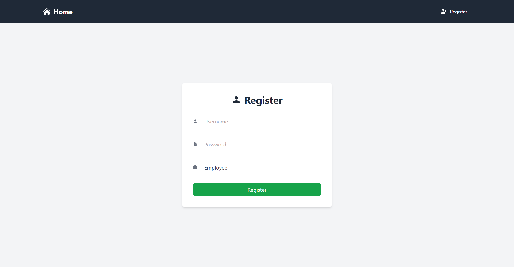

### Dashboard (Employee View)

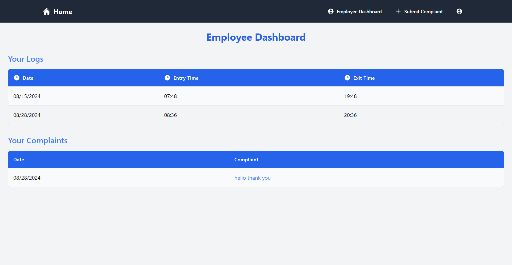

### Dashboard (Manager View)

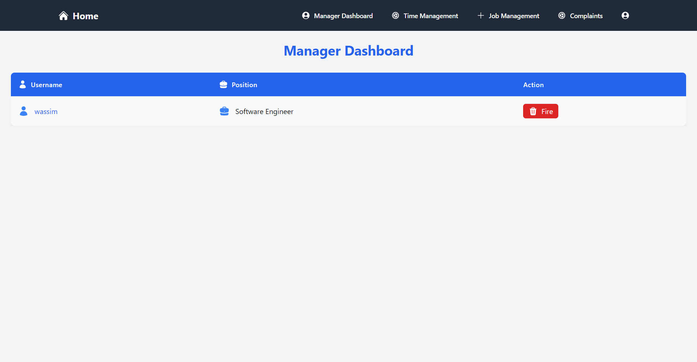

### Job Announcements (Employee View)

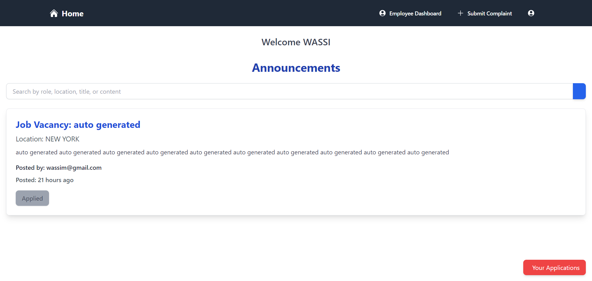

### Job Announcements (Manager View)

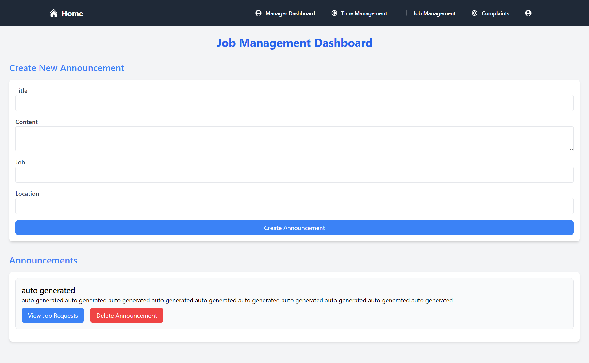

### Job Request Submission

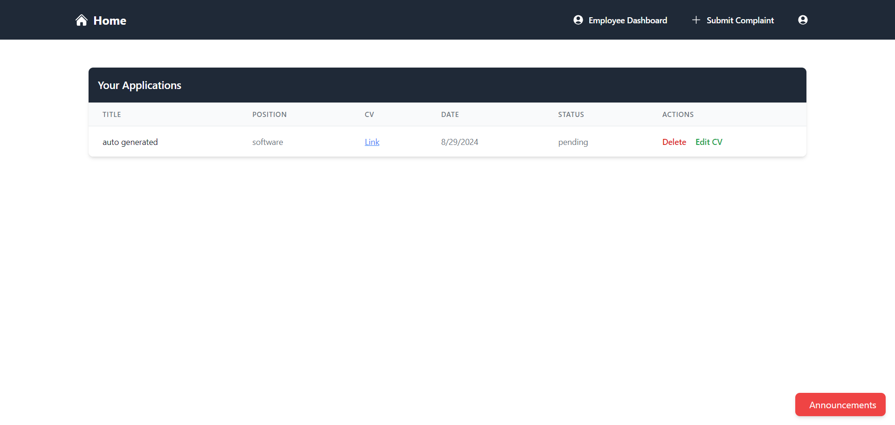

### Job Request Management

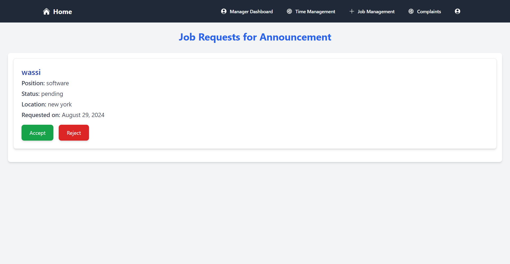

### Logs (Employee View)


### Logs (Manager View)

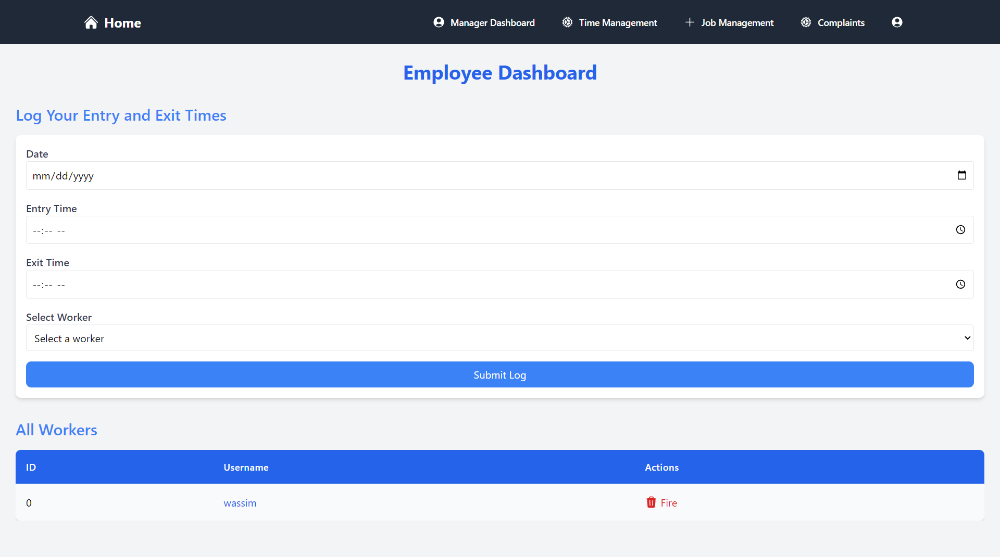

### Complaint Submission

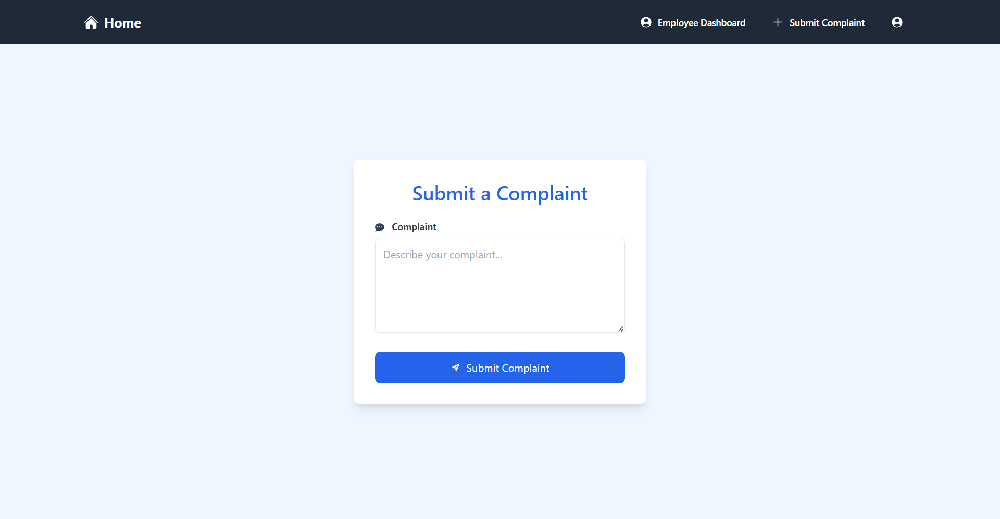

### Complaint Delete And Edit

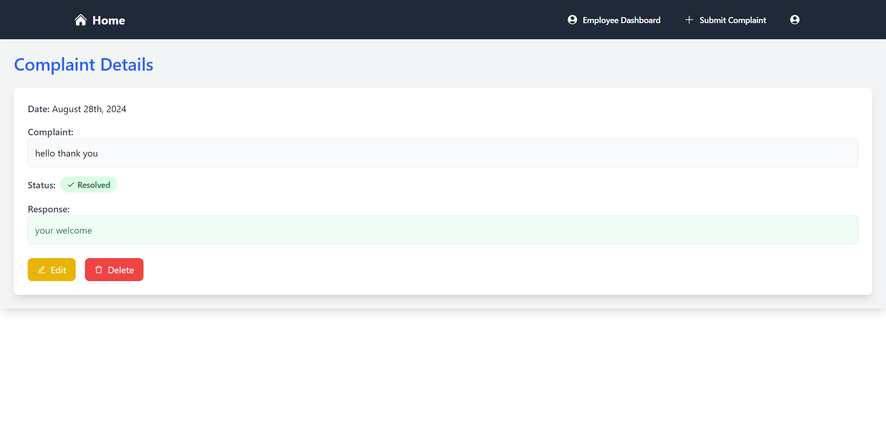

### Complaint Management

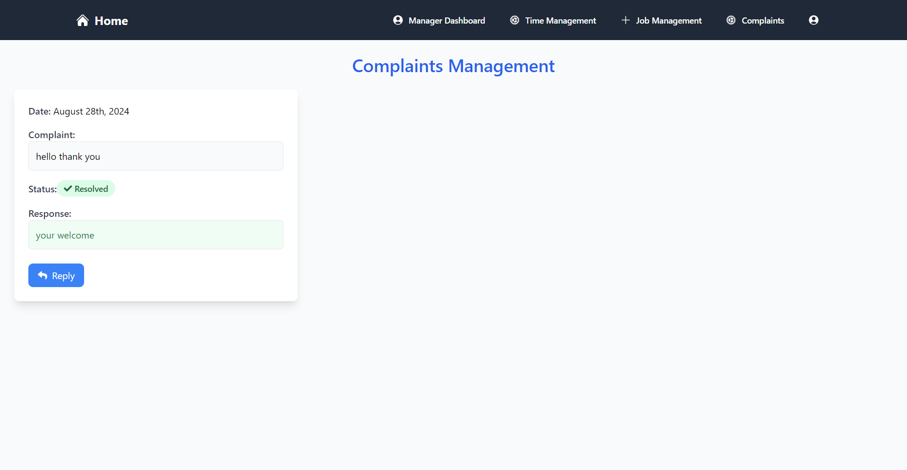

### User Profile

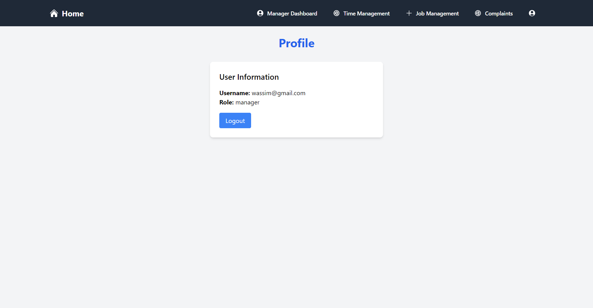

### Mobile Responsive

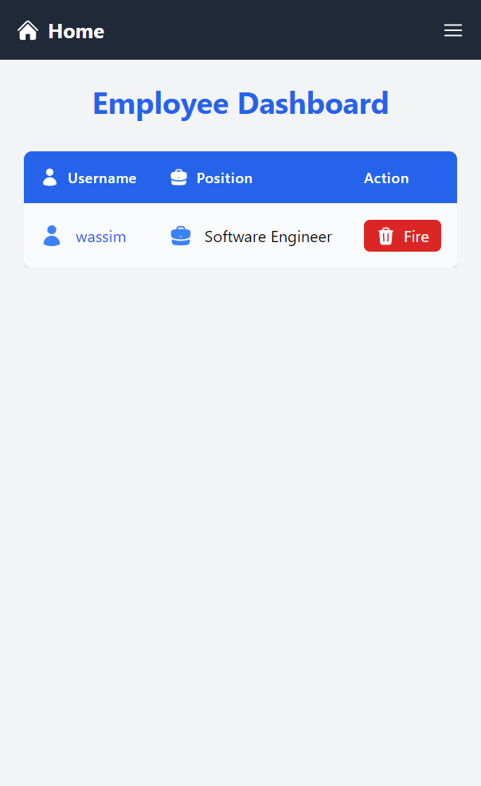

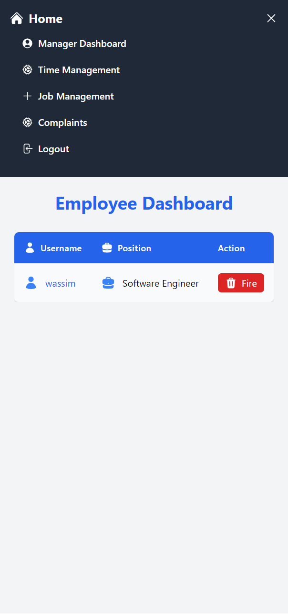

### Search Markdown

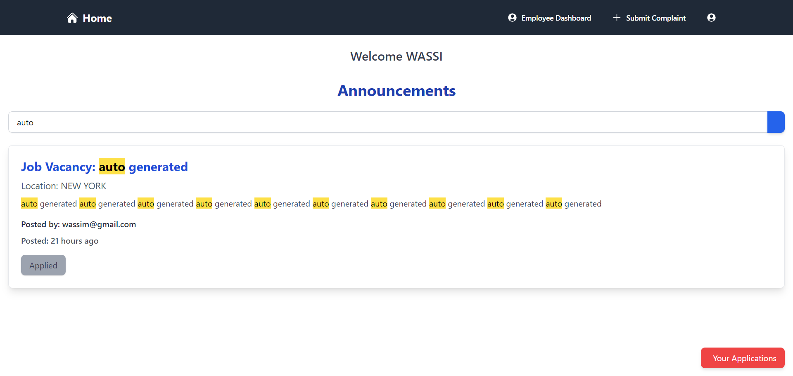

## Features

- **User Authentication:** Login and registration functionality with JWT-based authentication.

- **Role-Based Access Control:** Different access levels for managers and employees.

- **Employee Management:** Managers can add, update, and remove employees.

- **Job Management:** Post, edit, and manage job listings.

- **Complaint Management:** Submit, view, and manage employee complaints.

- **Profile Management:** View and update user profiles.

## Tech Stack

### Frontend:

- React.js

- Tailwind CSS

- Axios

- React Router

### Backend:

- Node.js

- Express.js

- MongoDB

- Mongoose

- JWT for authentication

## Installation

### Prerequisites

- Node.js

- npm or yarn

- MongoDB

### Clone the repository

```bash

git clone https://github.com/wassimOubaziz/PRODIGY_FS_02.git

cd PRODIGY_FS_02

```

### Install frontend dependencies

```bash

cd frontend

npm install

```

### Install backend dependencies

```bash

cd ../backend

npm install

```

### Environment Variables

Create a `.env` file in the backend directory and add the following:

```plaintext

MONGO_URI=your_mongo_uri

JWT_SECRET=your_jwt_secret

PORT=5000

```

## Usage

### Run the backend server

```bash

cd backend

npm start

```

### Run the frontend

```bash

cd frontend

npm run dev

```

### Access the application

Navigate to `http://localhost:5173` in your browser.

# API Endpoints

## Authentication

### Register

- **Route:** `POST /api/users/register`

- **Description:** Registers a new user.

- **Body:** `{ username, password, role, manager }`

- **Response:** Returns the created user object.

### Login

- **Route:** `POST /api/users/login`

- **Description:** Authenticates a user and returns a token.

- **Body:** `{ username, password }`

- **Response:** Returns a token and user information.

## Employees

### Get All Employees

- **Route:** `GET /api/employees`

- **Description:** Retrieves all employees. For admins, it returns all employees. For managers, it returns employees under their management.

- **Response:** Returns an array of employee objects.

### Create Employee

- **Route:** `POST /api/employees`

- **Description:** Creates a new employee.

- **Body:** `{ name, email, position, manager }`

- **Response:** Returns the created employee object.

### Update Employee

- **Route:** `PUT /api/employees/:id`

- **Description:** Updates an existing employee's information.

- **Body:** `{ name, email, position }`

- **Response:** Returns the updated employee object.

### Delete Employee

- **Route:** `DELETE /api/employees/:id`

- **Description:** Deletes an employee.

- **Response:** Returns a 204 status code on success.

## Job Announcements (Employee View)

### Get All Announcements and Job Requests

- **Route:** `GET /api/announcements`

- **Description:** Retrieves all job announcements and the user's job requests.

- **Response:** Returns announcements, job requests, and user information.

### Add Job Request

- **Route:** `POST /api/announcements`

- **Description:** Submits a job request for an announcement.

- **Body:** `{ cv, announcementId }`

- **Response:** Returns the created job request.

### Delete Job Request

- **Route:** `DELETE /api/announcements/:id`

- **Description:** Deletes a job request made by the user.

- **Response:** Returns updated job requests on success.

### Update Job Request

- **Route:** `PUT /api/announcements/:id`

- **Description:** Updates the CV of a job request.

- **Body:** `{ cv }`

- **Response:** Returns updated job requests.

### Get User's Job Requests

- **Route:** `GET /api/announcements/myJobRequests`

- **Description:** Retrieves all job requests made by the user.

- **Response:** Returns an array of job request objects.

## Job Announcements (Manager View)

### Get Manager's Announcements

- **Route:** `GET /api/announcements-manager`

- **Description:** Retrieves all announcements created by the manager.

- **Response:** Returns an array of announcement objects.

### Create Announcement

- **Route:** `POST /api/announcements-manager`

- **Description:** Creates a new job announcement.

- **Body:** `{ title, job, location, content }`

- **Response:** Returns the created announcement object.

### Delete Announcement

- **Route:** `DELETE /api/announcements-manager/:id`

- **Description:** Deletes a job announcement.

- **Response:** Returns a 204 status code on success.

### Get Job Requests for Announcement

- **Route:** `GET /api/announcements-manager/:id/jobRequests`

- **Description:** Retrieves all job requests for a specific announcement.

- **Response:** Returns an array of job request objects.

### Accept Job Request

- **Route:** `PUT /api/announcements-manager/:id/accept`

- **Description:** Accepts a job request, updating user and manager information.

- **Response:** Returns the updated job request.

### Reject Job Request

- **Route:** `PUT /api/announcements-manager/:id/reject`

- **Description:** Rejects a job request.

- **Response:** Returns the updated job request.

## Logs (Manager View)

### Get Employee Logs

- **Route:** `GET /api/logs/:employeeId`

- **Description:** Retrieves all logs for a specific employee under the manager.

- **Response:** Returns an array of log objects.

### Create Log

- **Route:** `POST /api/logs`

- **Description:** Creates a new log entry for an employee.

- **Body:** `{ workerId, entryTime, exitTime, date }`

- **Response:** Returns the created log object.

## Logs (Employee View)

### Get Employee's Own Logs

- **Route:** `GET /api/logsEm`

- **Description:** Retrieves all logs for the authenticated employee.

- **Response:** Returns an array of log objects.

## Complaints

### Get All Complaints (Manager)

- **Route:** `GET /api/complaints`

- **Description:** Retrieves all complaints for the manager.

- **Response:** Returns an array of complaint objects.

### Get User's Complaints

- **Route:** `GET /api/complaints/user`

- **Description:** Retrieves all complaints made by the authenticated user.

- **Response:** Returns an array of complaint objects.

### Get Specific Complaint

- **Route:** `GET /api/complaints/:id`

- **Description:** Retrieves a specific complaint by ID.

- **Response:** Returns the complaint object.

### Create Complaint

- **Route:** `POST /api/complaints`

- **Description:** Creates a new complaint.

- **Body:** `{ complaint }`

- **Response:** Returns the created complaint object.

### Update Complaint

- **Route:** `PUT /api/complaints/:id`

- **Description:** Updates an existing complaint.

- **Body:** `{ complaint }`

- **Response:** Returns the updated complaint object.

### Delete Complaint

- **Route:** `DELETE /api/complaints/:id`

- **Description:** Deletes a complaint.

- **Response:** Returns a 204 status code on success.

### Resolve Complaint

- **Route:** `PUT /api/complaints/:id/resolve`

- **Description:** Marks a complaint as resolved and adds a response.

- **Body:** `{ response }`

- **Response:** Returns a 204 status code on success.

## User Profile

### Get User Profile

- **Route:** `GET /api/user/profile`

- **Description:** Retrieves the authenticated user's profile.

- **Response:** Returns the user object (excluding password).

### Update User Profile

- **Route:** `PUT /api/user/profile`

- **Description:** Updates the authenticated user's profile.

- **Body:** `{ username, email, role }`

- **Response:** Returns the updated user object.

## Folder Structure

```

/project-root

|-- /frontend

| |-- /public

| |-- /src

| | |-- /assets

| | |-- /components

| | |-- /pages

| | |-- App.js

| | |-- index.js

| |-- package.json

| |-- vite.config.js

|

|-- /backend

| |-- /controllers

| |-- /models

| |-- /routes

| |-- /middlewares

| |-- /config

| |-- server.js

| |-- package.json

|

|-- README.md

```

## Contributing

Contributions are welcome! Please open an issue or submit a pull request.

## License

This project is licensed under the MIT License - see the LICENSE file for details.
